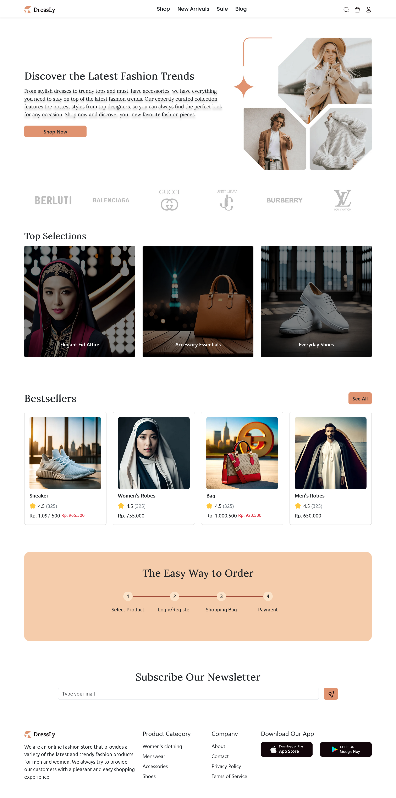

## Project Overview

Dressly is a project focused on slicing design for a clothing store, originally created by codedesign.dev. The project utilizes React as its primary technology stack.

## Features

- Responsive design
- Modern UI/UX
- Easy to navigate

## Tech Stack

- React

## Screenshots

## Create Date

25 April 2021